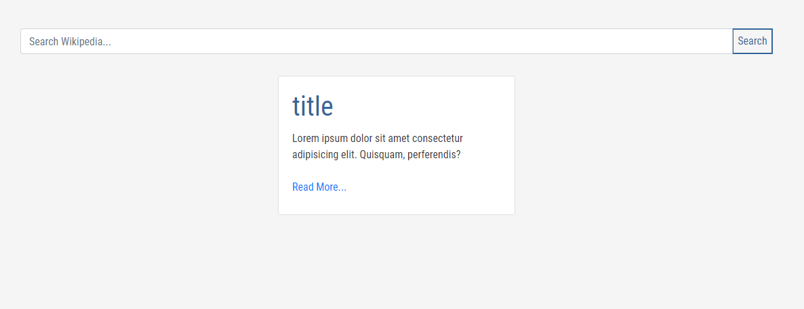
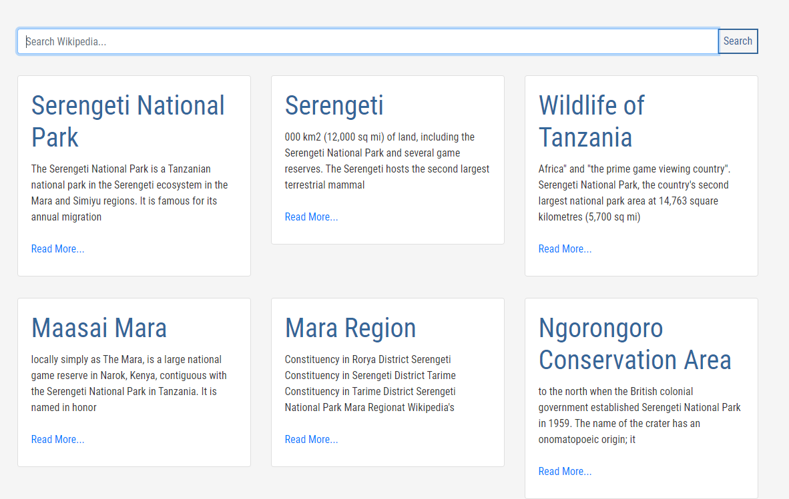
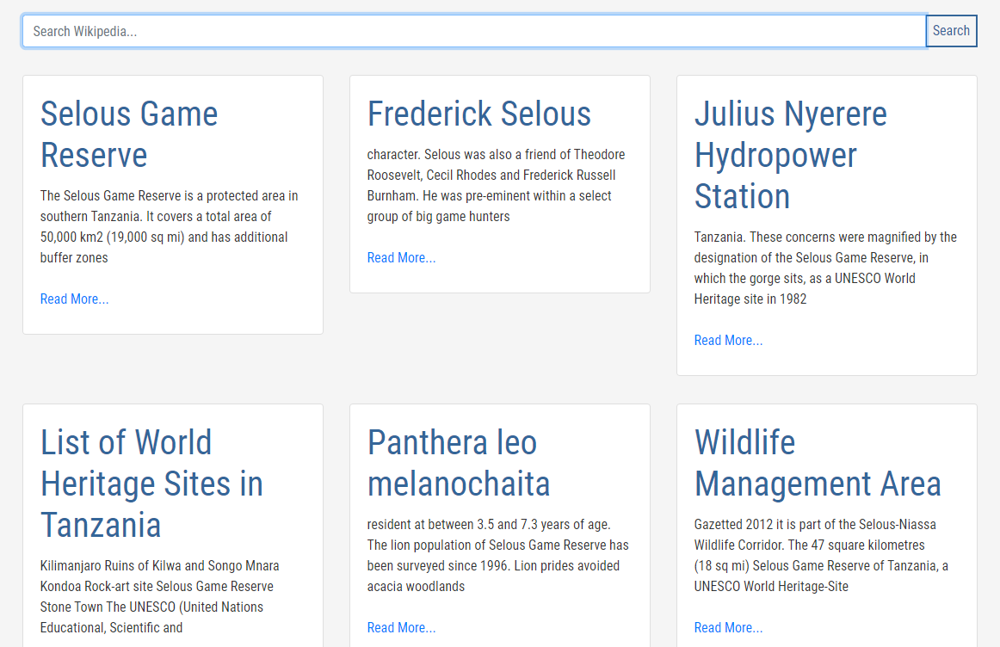

# Project: Practicing with API - Wikipedia Search App

> This is a practice project on fetching data from the API, searching data from the wikipedia website. You can query any data and the app will search from Wikipedia's database and display 10 items it found on the queried search term.

## Built With

- HTML
- CSS
- java script
- Webpack
- Bootstrap

## Live Version

[Live Link](https://emmanuelkamala.github.io/wikipediaSearch/)

## Getting Started

Open your terminal or text editor and use next command

        git clone https://github.com/emmanuelkamala/wikipediaSearch.git

        cd wikipediaSearch

After if you want to do any changes please create new branch, after changes open pull request.
Happy coding! 

## Author

👤 **Author**

- Github: [emmanuelkamala](https://github.com/emmanuelkamala)
- Twitter: [ejkamala](https://twitter.com/ejkamala)
- Linkedin: [emmanuelkamala](https://linkedin.com/in/emmanuelkamala)

## 🤝 Contributing

Contributions, issues and feature requests are welcome!

Feel free to check the [issues page](issues/).

## Show your support

Give a ⭐️ if you like this project!

## Acknowledgments

- The odin project
- Microverse tips

## 📝 License

This project is [MIT](lic.url) licensed.